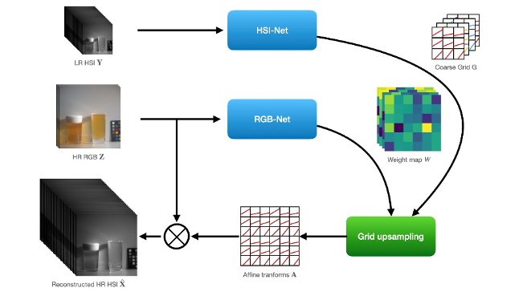
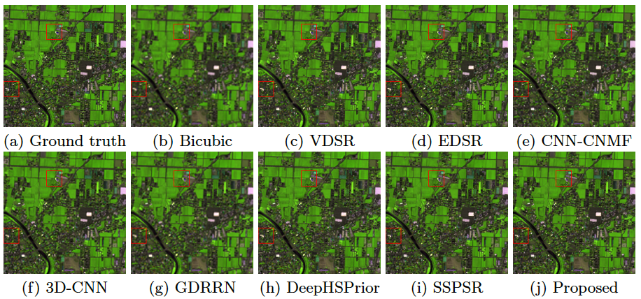
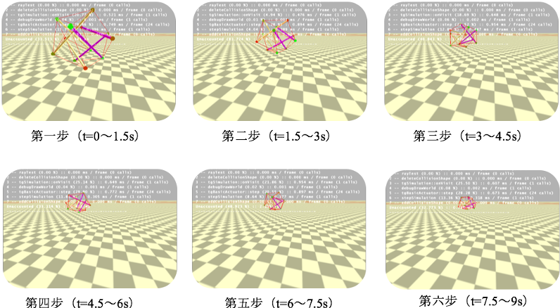

# About me
Hi, I'm Hayden and I'm currently working as a GPU software engineer in Shanghai.

Prior to that, I got my M.Eng. in computer science and B.Eng. in mechatronics both from Harbin Institute of Technology. Please refer to the Projects for more detailed info. 

During previous study, my main focus are among image/video restoration, enhancement and perception and control. Besides, I'm also interested in repetitive & fractal patterns, textures and structures.

# How to reach me

Send me an email: <mark>hayden.sun@yahoo.com</mark>

# Projects

<table>
<tr>
<td style="width: 30%">
  

  
  

  </td>
  <td style="width: 70%;">
  

  

   Fast Hyperspectral Image Sharpening via Learned Affine Transform
   

   

   <i>Fast LUT-based method in image fusion.</i>
   

   

   <a href="https://kns.cnki.net/kcms/detail/detail.aspx?dbcode=CMFD&dbname=CMFD202201&filename=1021901980.nh&uniplatform=NZKPT&v=_51FfsNBPS5TeMNWYVVzgqophntBsQGRVAxtg3vICwBER8WFD7KYoLBdWdBHdq_u">[CNKI (Chinese)]</a>
   

   

   </td>
 
 </tr>
 </table>

<table>
<tr>
<td style="width: 30%">
  

  
  

  </td>
  <td style="width: 70%;">
  

  

   Hyperspectral Image Super-resolution using Pyramid Method
   

   

   <i>"Utilizing Gaussian pyramid in DL-based image super-resolution."</i>
   

   

   <a href="https://haydenhs.github.io/HyperSR/">[Project]</a>
   <a href="https://link.springer.com/chapter/10.1007/978-981-15-3341-9_5">[Paper (old version)]</a>
   <a href="https://github.com/haydenhs/HyperSR">[Code]</a>
   <a href="https://kns.cnki.net/kcms/detail/detail.aspx?dbcode=CMFD&dbname=CMFD202201&filename=1021901980.nh&uniplatform=NZKPT&v=_51FfsNBPS5TeMNWYVVzgqophntBsQGRVAxtg3vICwBER8WFD7KYoLBdWdBHdq_u">[CNKI (Chinese)]</a>
   

   

   </td>
   </tr>
 </table>
 
 <table>
<tr>
<td style="width: 30%">
  

  
  

  </td>
  <td style="width: 70%;">
  

  

   Locomotion Simulation and Control for a 6-bar Spherical Tensegrity Robot
   

   

   <i>"Crossroad for structure design and engineering."</i>
   

   

   <a href="https://haydenhs.github.io/NTRTsim/">[Project]</a>
   <a href="https://www.youtube.com/watch?v=bPanVJEUQm8&feature=youtu.be">[Demo]</a>
   

   

   </td>
   </tr>
 </table>

